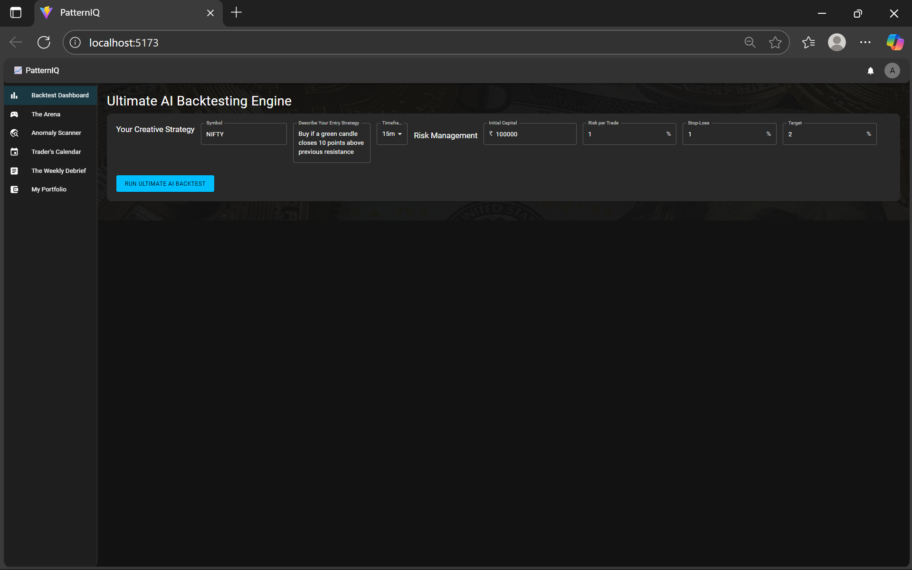
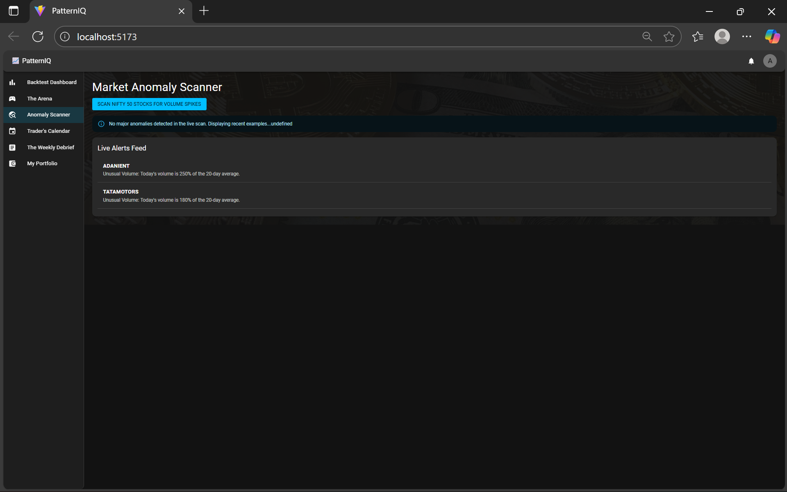

# 📈 PatternIQ | AI-Native Trading Intelligence Platform

[](https://www.python.org/) [](https://reactjs.org/) [](https://fastapi.tiangolo.com/) [](https://firebase.google.com/)

**PatternIQ is a full-stack, AI-powered web platform built for the SEBI Securities Market Hackathon to enhance retail investor education and engagement.**

It allows users to backtest complex trading strategies using plain English, compete in a gamified learning community, and receive real-time market insights, transforming trading from a game of chance into a skill-based discipline.



---

## Table of Contents
1. [About The Project](#about-the-project)
2. [Key Features](#key-features)
3. [Architecture Overview](#architecture-overview)
4. [Technology Stack](#technology-stack)
5. [Getting Started](#getting-started)
   - [Prerequisites](#prerequisites)
   - [Backend Setup](#backend-setup)
   - [Frontend Setup](#frontend-setup)
6. [Future Roadmap](#future-roadmap)

---

## About The Project

For most retail traders in India, the stock market feels complex and intimidating. They have creative trading ideas but no way to test them without learning to code. This turns trading into guesswork, leading to poor, emotion-driven decisions.

PatternIQ solves this by providing a suite of AI-native tools in a single, intuitive platform. Our mission is to democratize the tools of professional traders and make the market more accessible, educational, and engaging for everyone.

---

## Key Features

🏆 **The Arena: A Gamified Learning Hub**
- **Personalized Daily Quizzes:** A new, AI-generated quiz is created every day based on recent market news. The difficulty (Levels 1-20) adapts to the user's skill, which is based on their Reputation Points (RP).
- **Live Leaderboard & Profiles:** Users compete for RP and can view each other's profiles and ranks, fostering a fun and competitive learning environment.

🧠 **The Ultimate AI Backtesting Engine**
- **True No-Code:** Users describe complex strategies in plain English (e.g., "Buy on a resistance breakout if MACD is positive").
- **Three-Stage AI Workflow:** A unique system uses AI to first parse the user's intent, then dynamically generate the Python code for analysis, and finally provide a detailed performance review.
- **Detailed Analysis:** Results include interactive equity/drawdown charts, key metrics like Profit Factor, and a full AI-written report with actionable insights.



📅 **The Interactive Trader's Calendar**
- **AI-Powered Events:** The calendar is automatically populated with key market events (Domestic, Global, Corporate) generated by AI daily.
- **Personal & Secure Notes:** Users can add, edit, and delete their own private notes and trade ideas on any date. This data is stored securely in their personal user document in Firebase.

---

## Architecture Overview

1.  **Frontend (React):** The user interacts with the React single-page application.
2.  **Backend (FastAPI):** The Python backend serves as the brain, handling all business logic and orchestrating calls to the Google Gemini API.
3.  **AI (Google Gemini):** Used for specialized tasks: parsing natural language, generating Python code, creating quiz questions, and writing analytical reports.
4.  **Database (Firebase Firestore):** A real-time NoSQL database stores all user profiles, private calendar notes, and cached AI-generated content.

---

## Technology Stack

- **AI/ML:** Python, Google Gemini API, Pandas, NumPy, Pandas-TA.
- **Backend:** FastAPI, Uvicorn, Pydantic.
- **Frontend:** React, JavaScript, Material-UI (MUI), MUI X Charts, Axios, Vite.
- **Database & Auth:** Google Firebase (Firestore), Google OAuth 2.0.

---

## Getting Started

To get a local copy up and running, follow these simple steps.

### Prerequisites

- Python 3.10+
- Node.js 18.x or higher
- `git` installed on your machine

### Backend Setup

The backend server is the engine of the application. It **must be running** for the frontend to work.

1.  **Navigate to the backend directory**
    ```sh
    cd backend
    ```
2.  **Create and activate a virtual environment**
    ```sh
    # Create the environment (only needs to be done once)
    python -m venv venv
    ```
    ```sh
    # Activate the environment (must be done every time you open a new terminal)
    # On Windows:
    .\venv\Scripts\activate
    # On Mac/Linux:
    source venv/bin/activate
    ```
3.  **Install Python packages**
    ```sh
    pip install -r requirements.txt
    ```
4.  **Add Your Secret Keys (CRITICAL)**
    - Create a file named `.env` in the `backend` folder and add your Gemini API key:
      ```
      GEMINI_API_KEY="your_gemini_api_key_here"
      ```
    - Download your `serviceAccountKey.json` from your Firebase project settings and place it in the `backend` folder.

5.  **Run the Backend Server**
    ```sh
    uvicorn main:app --reload
    ```
    The server will be running at `http://127.0.0.1:8000`. **You must leave this terminal window open and running in the background.**

### Frontend Setup

The frontend is the user interface you see in the browser. It needs its own terminal window.

1.  **Open a new terminal** and navigate to the frontend directory
    ```sh
    cd frontend 
    ```
2.  **Install NPM packages**
    ```sh
    npm install
    ```
3.  **Add Your Secret Keys (CRITICAL)**
    - Open `frontend/src/App.jsx` and replace the `GOOGLE_CLIENT_ID` placeholder.
    - Open `frontend/src/firebase.js` and replace the `firebaseConfig` placeholder.

4.  **Run the Frontend App**
    ```sh
    npm run dev
    ```
    The application will be available at `http://localhost:5173`.

---

## Future Roadmap

- **Phase 1:** Implement detailed trade logs, data export, and a "My Strategies" hub.
- **Phase 2:** Launch the full "Weekly Debrief" community feature.
- **Phase 3:** Build the live, AI-summarized news feed.
- **Phase 4:** Create the verified SEBI Registered Analyst Hub.
- **Phase 5:** Integrate Blockchain for verifiable reputation and DPI (Aadhaar/UPI) for secure KYC and payments.