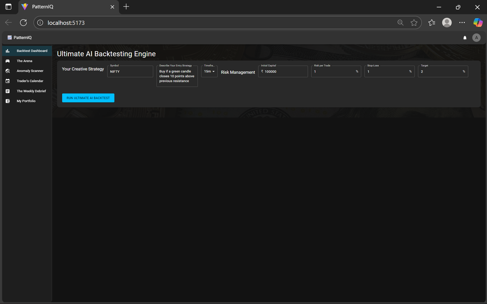
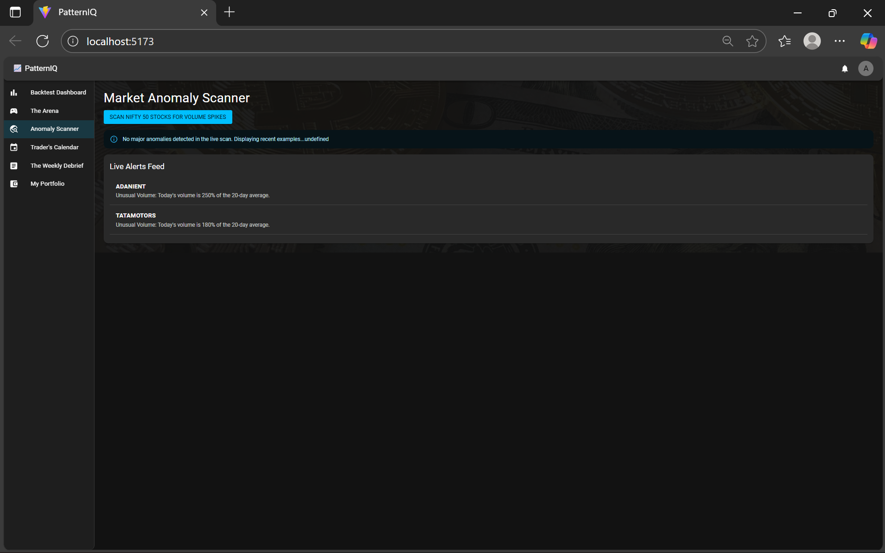

# 📈 PatternIQ | AI-Native Trading Intelligence Platform

[](https://www.python.org/) [](https://reactjs.org/) [](https://fastapi.tiangolo.com/) [](https://firebase.google.com/)

**PatternIQ is a full-stack, AI-powered web platform built for the SEBI Securities Market Hackathon to enhance retail investor education and engagement.**

It lets users backtest trading strategies in plain English, track a live portfolio, scan the market for anomalies, compete in a gamified learning arena, and debate weekly market scenarios with a community — turning trading from a game of chance into a skill-based discipline.



---

## Table of Contents
1. [About The Project](#about-the-project)
2. [Key Features](#key-features)
3. [Architecture Overview](#architecture-overview)
4. [Technology Stack](#technology-stack)
5. [Getting Started](#getting-started)
   - [Prerequisites](#prerequisites)
   - [Backend Setup](#backend-setup)
   - [Frontend Setup](#frontend-setup)
6. [Deployment & Keep-Alive](#deployment--keep-alive)
7. [Developer Tools](#developer-tools)
8. [Future Roadmap](#future-roadmap)

---

## About The Project

For most retail traders in India, the stock market feels complex and intimidating. They have creative trading ideas but no way to test them without learning to code. This turns trading into guesswork, leading to poor, emotion-driven decisions.

PatternIQ solves this by providing a suite of AI-native tools in a single, intuitive platform. Our mission is to democratize the tools of professional traders and make the market more accessible, educational, and engaging for everyone.

---

## Key Features

🧠 **The AI Backtesting Engine**
- **True no-code:** describe strategies in plain English (e.g., *"Buy on a resistance breakout if MACD is positive"*), or upload your own Python script.
- **Three-stage AI workflow:** the AI first parses your intent, then generates the analysis code, then writes a detailed performance review.
- **Secure execution:** AI- or user-supplied strategy code runs inside a hardened sandbox — an AST allow-list with no filesystem, network, import, or secret access, executed in an isolated subprocess with a hard timeout (never a raw `exec`).
- **Detailed results:** interactive equity & drawdown charts, key metrics (win rate, profit factor, max drawdown), a downloadable `.py`, and an AI-written report with actionable insights.

💼 **Portfolio & AI Risk Officer**
- Add holdings **manually**, or **connect your Zerodha (Kite Connect)** account to import them automatically.
- **Live prices, P&L, and sector allocation** via yfinance, plus a **computed risk score** (sector concentration + single-position weight + weighted volatility).
- An **AI Risk Officer** audits your exposure for over-concentration and correlation risk.

🔭 **The Anomaly Scanner**
- Scans NSE indices for **volume spikes, price breakouts, RSI extremes, and MACD crossovers**, with live alerts streamed in real time from Firestore.

🏆 **The Arena: A Gamified Learning Hub**
- **AI-generated daily quizzes** (Levels 1–20) tuned to your skill, a **live leaderboard**, public profiles, and per-user history.

💬 **Community Hub & The Weekly Debrief**
- Share strategies and discuss the market with **tag search and up/down voting**.
- A **fresh AI-generated macro scenario every week** — post your stance (Bullish/Bearish/Neutral) and vote on the community's best analyses.

📅 **The Interactive Trader's Calendar**
- **AI-powered events:** key market events (Domestic, Global, Corporate) generated daily and cached.
- **Personal & secure notes:** add, edit, and delete your own private trade ideas, stored in your Firebase user document.

🔐 **Accounts**
- **Google OAuth** and **Firebase email/password** sign-in, with email verification and **password reset (forgot password)**.



---

## Architecture Overview

1. **Frontend (React + Vite):** a single-page app, deployed on **Vercel**.
2. **Backend (FastAPI):** the brain — business logic and orchestration — deployed on **Hugging Face Spaces** (Docker).
3. **AI (OpenRouter → Gemini 2.5 Flash Lite):** natural-language parsing, strategy-code generation, quiz/calendar/debrief generation, and analytical reports.
4. **Market Data (yfinance):** historical and live prices for backtests, the scanner, and the portfolio.
5. **Broker (Zerodha Kite Connect):** optional OAuth import of real holdings (env-gated).
6. **Database & Auth (Firebase):** Firestore stores users, holdings, posts, calendar notes, and cached AI content; Firebase Auth handles sign-in.
7. **Strategy Sandbox:** validates and isolates untrusted strategy code before it ever runs.

---

## Technology Stack

- **AI / Data:** Python, OpenRouter (Gemini 2.5 Flash Lite), Pandas, NumPy, pandas-ta, yfinance.
- **Backend:** FastAPI, Uvicorn, Pydantic.
- **Frontend:** React 18, Vite, Material-UI (MUI) + MUI X Charts, Recharts, Axios.
- **Database & Auth:** Firebase Firestore, Firebase Auth, Google OAuth 2.0.
- **Broker (optional):** Zerodha Kite Connect.
- **Deployment:** Hugging Face Spaces (backend, Docker) · Vercel (frontend).

---

## Getting Started

To get a local copy up and running, follow these steps.

### Prerequisites

- Python 3.10+ (the Space runs 3.12)
- Node.js 18.x or higher
- `git` installed on your machine

### Backend Setup

The backend server is the engine of the application. It **must be running** for the frontend to work.

1.  **Navigate to the backend directory**
    ```sh
    cd backend
    ```
2.  **Create and activate a virtual environment**
    ```sh
    python -m venv venv
    # Windows:
    .\venv\Scripts\activate
    # Mac/Linux:
    source venv/bin/activate
    ```
3.  **Install Python packages**
    ```sh
    pip install -r requirements.txt
    ```
4.  **Add your secret keys (CRITICAL)** — create a file named `.env` in the `backend` folder:
    ```
    OPENROUTER_API_KEY="your_openrouter_api_key_here"

    # Optional — only needed to enable "Connect Zerodha" in the Portfolio:
    KITE_API_KEY="your_kite_connect_api_key"
    KITE_API_SECRET="your_kite_connect_api_secret"
    ```
    For Firebase, either set `FIREBASE_SERVICE_ACCOUNT` (your service-account JSON as a single-line string — used in production) **or** download `serviceAccountKey.json` from Firebase project settings into the `backend` folder (for local development).

5.  **Run the backend server**
    ```sh
    uvicorn main:app --reload
    ```
    The server runs at `http://127.0.0.1:8000`. **Leave this terminal open.**

### Frontend Setup

The frontend is the user interface. It needs its own terminal window.

1.  **Open a new terminal** and go to the frontend directory
    ```sh
    cd frontend
    ```
2.  **Install NPM packages**
    ```sh
    npm install
    ```
3.  **Configure the app**
    - Create/edit `frontend/.env` to point at your backend:
      ```
      VITE_API_URL=http://127.0.0.1:8000
      ```
    - Set `GOOGLE_CLIENT_ID` in `src/App.jsx` and `firebaseConfig` in `src/firebase.js`.

4.  **Run the frontend app**
    ```sh
    npm run dev
    ```
    The app is available at `http://localhost:5173`.

---

## Deployment & Keep-Alive

- **Frontend → Vercel.** Auto-deploys on push to `main`; build command is `vite build` (root directory: `frontend`).
- **Backend → Hugging Face Spaces (Docker).** The Space mirrors the `backend/` folder at its root; deploy with:
  ```sh
  git subtree push --prefix=backend hf main
  ```
  Set `OPENROUTER_API_KEY`, `FIREBASE_SERVICE_ACCOUNT` (and optional `KITE_API_KEY` / `KITE_API_SECRET`) as **Space secrets** in the HF settings.
- **Keep-alive.** Free HF Spaces sleep after 48h of inactivity, and only *external* requests reset that timer. [`.github/workflows/keep-alive.yml`](.github/workflows/keep-alive.yml) pings the Space every ~2 hours (the reliable method); the backend also runs a best-effort in-app self-ping while it's awake. For a hard guarantee, add an external uptime monitor (UptimeRobot / cron-job.org) on the same URL, or upgrade the Space to paid hardware.

---

## Developer Tools

- **Code Navigator** — open [`CODE_NAVIGATOR.html`](CODE_NAVIGATOR.html) for a single, searchable map of every API endpoint, React component, and function (each with a one-line description and clickable file:line), plus a **Feature Map** and a **connection matrix** showing how the features wire together. Regenerate it after code changes with:
  ```sh
  python tools/generate_navigator.py
  ```
- **Audit report** — [`PROJECT_AUDIT_REPORT.md`](PROJECT_AUDIT_REPORT.md) is a candid review of what's real vs. demo data and a prioritized enhancement roadmap.

---

## Future Roadmap

- **Per-endpoint authentication** — verify Firebase ID tokens server-side so a user can only read/write their own data.
- **Backtest realism** — slippage, brokerage/STT charges, position sizing, short selling, and Sharpe/Sortino metrics.
- **Live, AI-summarized news feed.**
- **Verified SEBI Registered Analyst Hub.**
- **Blockchain reputation + DPI (Aadhaar/UPI)** for verifiable reputation, secure KYC, and payments.
